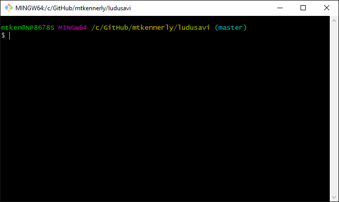

#  Ludusavi
Ludusavi is a tool for backing up your PC video game save data,
written in [Rust](https://www.rust-lang.org).
It is cross-platform and supports multiple game stores.

## Features
* Ability to back up data from more than 10,000 games plus your own custom entries.
* Backup and restore for Steam as well as other game libraries.
* Both a graphical interface and command line interface for scripting.
  Tab completion is available for Bash, Fish, Zsh, PowerShell, and Elvish.
* Support for:
  * Saves that are stored as files and in the Windows registry.
  * Proton saves with Steam.
  * Steam screenshots.
* Available as a [Playnite](https://playnite.link) extension:
  https://github.com/mtkennerly/ludusavi-playnite
* Works on the Steam Deck.

This tool uses the [Ludusavi Manifest](https://github.com/mtkennerly/ludusavi-manifest)
for info on what to back up, and it will automatically download the latest version of
the primary manifest. The data is ultimately sourced from [PCGamingWiki](https://www.pcgamingwiki.com/wiki/Home),
so please contribute any new or fixed data back to the wiki itself, and your
improvements will be incorporated into Ludusavi's data as well.

If you'd like to help translate Ludusavi into other languages,
[check out the Crowdin project](https://crowdin.com/project/ludusavi).

## Demo
### GUI
> 

### CLI
> 

## Installation
### Requirements
* Ludusavi is available for Windows, Linux, and Mac.
* Your system must support one of DirectX, Vulkan, or Metal.
  (If not, set the `ICED_BACKEND` environment variable to `tiny-skia` to use the software renderer.)

### Methods
You can install Ludusavi one of these ways:

* Download the executable for your operating system from the
  [releases page](https://github.com/mtkennerly/ludusavi/releases).
  It's portable, so you can simply download it and put it anywhere
  on your system.
  **If you're unsure, choose this option.**

* On Windows, you can use [Winget](https://github.com/microsoft/winget-cli).

  * To install: `winget install -e --id mtkennerly.ludusavi`
  * To update: `winget upgrade -e --id mtkennerly.ludusavi`

* On Windows, you can use [Scoop](https://scoop.sh).

  * To install: `scoop bucket add extras && scoop install ludusavi`
  * To update: `scoop update && scoop update ludusavi`

* For Linux, Ludusavi is available on [Flathub](https://flathub.org/apps/details/com.github.mtkennerly.ludusavi).
  Note that it has limited file system access by default (`~` and `/run/media`).
  If you'd like to enable broader access, [see here](https://github.com/flathub/com.github.mtkennerly.ludusavi/blob/master/README.md).

* If you have [Rust](https://www.rust-lang.org), you can use Cargo.

  * To install or update: `cargo install --locked ludusavi`

  On Linux, this requires the following system packages, or their equivalents
  for your distribution:

  * Ubuntu: `sudo apt-get install -y gcc cmake libx11-dev libxcb-composite0-dev libfreetype6-dev libexpat1-dev libfontconfig1-dev`

### Notes
If you are on Windows:

* When you first run Ludusavi, you may see a popup that says
  "Windows protected your PC", because Windows does not recognize the program's
  publisher. Click "more info" and then "run anyway" to start the program.

If you are on Mac:

* When you first run Ludusavi, you may see a popup that says
  "Ludusavi can't be opened because it is from an unidentified developer".
  To allow Ludusavi to run, please refer to [this article](https://support.apple.com/en-us/HT202491),
  specifically the section on `How to open an app [...] from an unidentified developer`.

## Usage
### Roots
Roots are folders that Ludusavi can check for additional game data. When you
first run Ludusavi, it will try to find some common roots on your system, but
you may end up without any configured. These are listed on the "other" screen,
where you can use the plus button in the roots section to configure as many as you need,
along with the root's type:

* For a Steam root, this should be the folder containing the `steamapps` and
  `userdata` subdirectories. Here are some common/standard locations:
  * Windows: `C:/Program Files (x86)/Steam`
  * Linux: `~/.steam/steam`

  On Linux, for games that use Proton, Ludusavi will back up the `*.reg` files
  if the game is known to have registry-based saves.

  On Linux, if you've used Steam's "add a non-Steam game" feature,
  then Ludusavi will also back up any Proton save data for those games.
  This requires the shortcut name in Steam to match the title by which Ludusavi knows the game
  (i.e., the title of its PCGamingWiki article).
* For a Heroic root, this should be the folder containing the `gog_store`
  and `GamesConfig` subdirectories.

  Ludusavi can find GOG/Epic saves in Heroic's game install folders.
  On Linux, Ludusavi can also find saves in Heroic's Wine, Proton, and Lutris prefixes.
  However, Ludusavi does not yet support Heroic's Amazon or sideloaded games.

  When using Wine prefixes with Heroic, Ludusavi will back up the `*.reg` files
  if the game is known to have registry-based saves.
* For a Legendary root, this should be the folder containing `installed.json`.
  Currently, Ludusavi cannot detect Wine prefixes for Legendary roots.
* For a Lutris root, this should be the folder containing the `games` subdirectory.

  Ludusavi expects the game YAML files to contain a few fields,
  particularly `name` and either `game.working_dir` or `game.exe`.
  Games will be skipped if they don't have the necessary fields.
* For the "other" root type and the remaining store-specific roots,
  this should be a folder whose direct children are individual games.
  For example, in the Epic Games store, this would be what you choose as the
  "install location" for your games (e.g., if you choose `D:/Epic` and it
  creates a subfolder for `D:/Epic/Celeste`, then the root would be `D:/Epic`).
* For a home folder root, you may specify any folder. Whenever Ludusavi
  normally checks your standard home folder (Windows: `%USERPROFILE%`,
  Linux/Mac: `~`), it will additionally check this root. This is useful if
  you set a custom `HOME` to manipulate the location of save data.
* For a Wine prefix root, this should be the folder containing `drive_c`.
  Currently, Ludusavi does not back up registry-based saves from the prefix,
  but will back up any file-based saves.
* The Windows, Linux, and Mac drive roots can be used
  to make Ludusavi scan external hard drives with a separate OS installation.
  For example, let's say you had a Windows laptop that broke,
  but you recovered the hard drive and turned it into an external drive.
  You could add it as a Windows drive root to make Ludusavi scan it.

  In this case, Ludusavi can only look for normal/default locations of system folders.
  Ludusavi will not be able to use the Windows API or check `XDG` environment variables
  to detect alternative folder locations (e.g., if you've moved the `Documents` folder).

You may use [globs] in root paths to identify multiple roots at once.
If you have a folder name that contains a special glob character,
you can escape it by wrapping it in brackets (e.g., `[` becomes `[[]`).

The order of the configured roots is not significant.
The only case where it may make a difference is if Ludusavi finds secondary manifests (`.ludusavi.yaml` files)
*and* those manfiests contain overlapping entries for the same game,
in which case Ludusavi will merge the data together in the order that it finds them.

### Backup retention
You can configure how many backups to keep by pressing the gear icon on the backup screen.
A full backup contains all save data for a game,
while a differential backup contains just the data that has changed since the last full backup.

When Ludusavi makes a new backup for a game, it will also remove any excess backups for that specific game.
When a full backup is deleted, its associated differential backups are deleted as well.

For example, if you configure a retention limit of 2 full and 2 differential,
then Ludusavi will create 2 differential backups for each full backup, like so:

* Backup #1: full
  * Backup #2: differential
  * Backup #3: differential
* Backup #4: full
  * Backup #5: differential
  * Backup #6: differential

When backup #7 is created, because the full retention is set to 2,
Ludusavi will delete backups 1 through 3.

If your full retention is only 1 and your differential retention is 1+,
then Ludusavi will keep the full backup and just delete the oldest differential as needed.

On the restore screen, you can use the three-dot menu next to a game to lock any of its backups.
Locked backups do not count toward the retention limits and are retained indefinitely.

### Cloud backup
Ludusavi integrates with [Rclone](https://rclone.org) to provide cloud backups.
You can configure this on the "other" screen.
Any Rclone remote is supported, but Ludusavi can help you configure some of the more common ones:
Google Drive, OneDrive, Dropbox, Box, FTP servers, SMB servers, and WebDAV servers.
Support is verified for Rclone 1.62.2, but other versions should work as well.

If you turn on automtic synchronization,
then Ludusavi will check if your local and cloud saves are already in sync at the start of a backup.
If so, then any changes will be uploaded once the backup is done.
If they weren't in sync to begin with, then Ludusavi will warn you about the conflict and leave the cloud data alone.
You can perform an upload or download at any time on the "other" screen to resolve such a conflict.

Bear in mind that many factors can affect cloud sync performance,
including network speed, outages on the cloud side, and any limitations of Rclone itself.
You can try setting custom Rclone arguments if you find that it is too slow.
For example, `--fast-list` and/or `--ignore-checksum` can speed things up,
while `--transfers=1` can help to avoid rate-limiting but may slow things down.
The "other" screen has a field to configure custom arguments,
and you can find documentation for them here: https://rclone.org/flags

You can also use other cloud backup tools of your choice,
as long as they can make the storage available as what looks like a normal folder.
For example:

* If you use something like [Google Drive for Desktop](https://www.google.com/drive/download),
  which creates a special drive (`G:`) to stream from/to the cloud,
  then you can set Ludusavi's backup target to a folder in that drive.
* If you use something like [Syncthing](https://syncthing.net),
  which continuously synchronizes a local folder across systems,
  then you can set Ludusavi's backup target to that local folder.
* If you use Rclone's mounting functionality,
  then you can set Ludusavi's backup target to the mount folder.

### Selective scanning
Once you've done at least one full scan (via the preview/backup buttons),
Ludusavi will remember the games it found and show them to you the next time you run the program.
That way, you can selectively preview or back up a single game without doing a full scan.
Use the three-dot menu next to each game's title to operate on just that one game.

You can also use keyboard shortcuts to swap the three-dot menu with some specific buttons:

* preview: shift
* backup/restore: ctrl (Mac: cmd)
* backup/restore without confirmation: ctrl + alt (Mac: cmd + option)

### Backup structure
* Within the target folder, for every game with data to back up, a subfolder
  will be created based on the game's name, where some invalid characters are
  replaced by `_`. In rare cases, if the whole name is invalid characters,
  then it will be renamed to `ludusavi-renamed-<ENCODED_NAME>`.
* Within each game's subfolder, there will be a `mapping.yaml` file that
  Ludusavi needs to identify the game.

  When using the simple backup format, there will be some drive folders
  (e.g., `drive-C` on Windows or `drive-0` on Linux and Mac) containing the
  backup files, matching the normal file locations on your computer.
  When using the zip backup format, there will be zip files instead.
* If the game has save data in the registry and you are using Windows, then
  the game's subfolder will also contain a `registry.yaml` file (or it will
  be placed in each backup's zip file).
  If you are using Steam and Proton instead of Windows, then the Proton `*.reg`
  files will be backed up along with the other game files instead.

During a restore, Ludusavi only considers folders with a `mapping.yaml` file.

### Filter
You can click the filter icon at the top of the backup/restore screens to use some filters.
Note that this only affects which games you see in the list,
but Ludusavi will still back up the full set of games.

You can apply filters for the following:

* Whether the game title matches a search.
* Whether multiple games have the same save files:
  * `Unique` (no conflicts)
  * `Duplicated` (conflicts exist)
* Whether all save files for a game are enabled for processing:
  * `Complete` (all saves enabled)
  * `Partial` (some saves disabled)
* Whether the game itself is enabled for processing:
  * `Enabled` (checkbox next to game is checked)
  * `Disabled` (checkbox next to game is unchecked)

### Duplicates
You may see a "duplicates" badge next to some games. This means that some of
the same files were also backed up for another game. That could be intentional
(e.g., an HD remaster may reuse the original save locations), but it could
also be a sign of an issue in the manifest data. You can expand the game's
file list to see which exact entries are duplicated.

You can resolve conflicts by disabling certain save files from being backed up.
Once a conflict is resolved, the badge will become faded.
You can also click on the badge to view just the conflicting games.

### Redirects
You can use redirects to back up or restore to a different location than the original file.
These are listed on the "other" screen, where you can click the plus button to add more
and then enter both the old location (source) and new location (target).

There are multiple types of redirects:

* `Backup`: Applies only for backup mode.
* `Restore`: Applies only for restore mode.
* `Bidirectional`: Uses source -> target in backup mode and target -> source in restore mode.

For example:

* Let's say you backed up some saves from `C:/Games`, but then you decided to move it to `D:/Games`.
  You could create a restore redirect with `C:/Games` as the source and `D:/Games` as the target.
* Let's say you play on two computers with different usernames ("A" and "B"),
  but you know that the saves are otherwise the same,
  so you'd like them to share backups.
  You could create two bidirectional redirects:

  * On Computer A, set source to `C:/Users/A` and target to `C:/Users/main`
  * On computer B, set source to `C:/Users/B` and target to `C:/Users/main`

  Both computers' backups would reference the fake user "main",
  but then they would be restored to the original location for that computer.

Tip: As you're editing your redirects, try running a preview and expanding some
games' file lists. This will show you what effect your redirects
will have when you perform the restore for real.

### Custom games
You can create your own game save definitions on the `custom games` screen.
If the game name exactly matches a known game, then your custom entry will override it.

For file paths, you can click the browse button to quickly select a folder.
The path can be a file too, but the browse button only lets you choose
folders at this time. You can just type in the file name afterwards.
You can also use [globs]
(e.g., `C:/example/*.txt` selects all TXT files in that folder)
and the placeholders defined in the
[Ludusavi Manifest format](https://github.com/mtkennerly/ludusavi-manifest).
If you have a folder name that contains a special glob character,
you can escape it by wrapping it in brackets (e.g., `[` becomes `[[]`).

### Backup exclusions
Backup exclusions let you set paths and registry keys to completely ignore
from all games. They will not be shown at all during backup scans.

Configure exclusions on the "other" screen.

For excluded file paths, you can use glob syntax.
For example, to exclude all files named `remotecache.vdf`, you would specify `**/remotecache.vdf`.

### Backup validation
On the restore screen, there is a "validate" button that will check the integrity
of the latest backup (full + differential, if any) for each game.
You won't normally need to use this, but it exists for troubleshooting purposes.

Specifically, this checks the following:

* Is mapping.yaml malformed?
* Is any file declared in mapping.yaml, but missing from the actual backup?

If it finds problems, then it will prompt you to create new full backups for the games in question.
At this time, it will not remove the invalid backups, outside of your normal retention settings.

### Command line
Run `ludusavi --help` for the CLI usage information.
You can also view info for specific subcommands, such as `ludusavi manifest update --help`.

### Configuration
Ludusavi stores its configuration in the following locations:

* Windows: `%APPDATA%/ludusavi`
* Linux: `$XDG_CONFIG_HOME/ludusavi` or `~/.config/ludusavi`
  * Flatpak: `~/.var/app/com.github.mtkennerly.ludusavi/config/ludusavi`
* Mac: `~/Library/Application Support/ludusavi`

Alternatively, if you'd like Ludusavi to store its configuration in the same
place as the executable, then simply create a file called `ludusavi.portable`
in the directory that contains the executable file. You might want to do that
if you're going to run Ludusavi from a flash drive on multiple computers.

If you're using the GUI, then it will automatically update the config file
as needed, so you don't need to worry about its content. However, if you're
using the CLI exclusively, then you'll need to edit `config.yaml` yourself.

Ludusavi also stores `manifest.yaml` (info on what to back up) here.
You should not modify that file, because Ludusavi will overwrite your changes
whenever it downloads a new copy.

### Logging
Log files are stored in the config folder (see above).
By default, only warnings and errors are logged,
but you can customize this by setting the `RUST_LOG` environment variable
(e.g., `RUST_LOG=ludusavi=debug`).
The most recent 5 log files are kept, rotating on app launch or when a log reaches 10 MiB.

### Game launch wrapping
The CLI has a `wrap` command that can be used as a wrapper around launching a game.
When wrapped, Ludusavi will restore data for the game first, launch it, and back up after playing.
If you want to use this feature, you must manually configure your game launcher app to use this command.

If you use Heroic 2.9.2 or newer, you can run `wrap --infer heroic -- GAME_INVOCATION` to automatically check the game name.
For other launcher apps, you can run `wrap --name GAME_NAME -- GAME_INVOCATION`.

#### Example with Heroic 2.9.2 on Linux
Create a file named `ludusavi-wrap.sh` with this content:

```
$!/bin/sh
ludusavi --try-manifest-update --config $HOME/.config/ludusavi wrap --gui --infer heroic -- "$@"
```

Mark the file as executable and set it as a wrapper within Heroic.
You must set it as a wrapper for each game already installed individually.

Note that the `--config` option is required because Heroic overrides the `XDG_CONFIG_HOME` environment variable,
which would otherwise prevent Ludusavi from finding its configuration.

## Interfaces
### CLI API
CLI mode defaults to a human-readable format, but you can switch to a
machine-readable JSON format with the `--api` flag.

<details>
<summary>Click to expand</summary>

For the `backup`/`restore` commands:

* `errors` (optional, map):
  * `someGamesFailed` (optional, boolean): Whether any games failed.
  * `unknownGames` (optional, list of strings): Names of unknown games, if any.
  * `cloudConflict` (optional, empty map): When this field is present,
    Ludusavi could not automatically synchronize with the cloud because of conflicting data.
  * `cloudSyncFailed` (optional, empty map): When this field is present,
    Ludusavi tried and failed to automatically synchronize with the cloud.
* `overall` (map):
  * `totalGames` (number): How many games were found.
  * `totalBytes` (number): How many bytes are used by files associated with
    found games.
  * `processedGames` (number): How many games were processed.
    This excludes ignored, failed, and cancelled games.
  * `processedBytes` (number): How many bytes were processed.
    This excludes ignored, failed, and cancelled games.
  * `changedGames` (object): Total count of `new`, `same`, and `different` games.
* `games` (map):
  * Each key is the name of a game, and the value is a map with these fields:
    * `decision` (string): How Ludusavi decided to handle this game.

      Possible values:
      * `Processed`
      * `Ignored`
      * `Cancelled`
    * `change` (string): How this game compares to its previous backup (if doing a new backup)
      or how its previous backup compares to the current system state (if doing a restore).

      Possible values:
      * `New`
      * `Same`
      * `Different`
    * `files` (map):
      * Each key is a file path, and each value is a map with these fields:
        * `failed` (optional, boolean): Whether this entry failed to process.
        * `error` (optional, map):
          * `message` (string): If the entry failed, then this explains why.
        * `change` (string): Same as game-level field, but for a specific backup item.
        * `ignored` (optional, boolean): Whether this entry was ignored.
        * `bytes` (number): Size of the file.
        * `redirectedPath` (optional, string):
          If the file was backed up to a redirected location,
          then this is its location within the backup.
        * `originalPath` (optional, string): If the file was restored to a
          redirected location, then this is its original path.
        * `duplicatedBy` (optional, array of strings): Any other games that
          also have the same file path.
    * `registry` (map):
      * Each key is a registry path, and each value is a map with these fields:
        * `failed` (optional, boolean): Whether this entry failed to process.
        * `error` (optional, map):
          * `message` (string): If the entry failed, then this explains why.
        * `change` (string): Same as game-level field, but for a specific backup item.
        * `ignored` (optional, boolean): Whether this entry was ignored.
        * `duplicatedBy` (optional, array of strings): Any other games that
          also have the same registry path.
        * `values` (optional, map): Any registry values inside of the registry key.
          * `change` (string): Same as game-level field, but for a specific backup item.
          * `ignored` (optional, boolean): Whether this entry was ignored.
          * `duplicatedBy` (optional, array of strings): Any other games that
            also have the same registry key+value.

The `backups` command is similar, but without `overall`, and with each game containing
`{"backups": [ {"name": <string>, "when": <string>, "comment": <string>} ]}`.
The `find` command also does not have `overall`, and each game object is empty.

For the `cloud upload` and `cloud download` commands:

* `cloud` (map):
  * Each key is the path of a file relative to the cloud folder,
    and the value is a map with these fields:
    * `change` (string): Same as the `change` fields for the `backup` command.

Note that, in some error conditions, there may not be any JSON output,
so you should check if stdout was blank before trying to parse it.
If the command line input cannot be parsed, then the output will not be
in a stable format.

API output goes on stdout, but stderr may still be used for human-readable warnings/errors.
If stderr is not empty, you may want to log it,
since not all human-readable warnings have an API equivalent.

Example:

```json
{
  "errors": {
    "someGamesFailed": true,
  },
  "overall": {
    "totalGames": 2,
    "totalBytes": 150,
    "processedGames": 1,
    "processedBytes": 100,
  },
  "games": {
    "Game 1": {
      "decision": "Processed",
      "files": {
        "/games/game1/save.json": {
          "bytes": 100
        }
      },
      "registry": {
        "HKEY_CURRENT_USER/Software/Game1": {
          "failed": true
        }
      }
    },
    "Game 2": {
      "decision": "Ignored",
      "files": {
        "/games/game2/save.json": {
          "bytes": 50
        }
      },
      "registry": {}
    }
  }
}
```

</details>

### Configuration file
Here are the available settings in `config.yaml` (all are required unless otherwise noted):

<details>
<summary>Click to expand</summary>

* `runtime` (map):
  * `threads` (integer): How many threads to use for parallel scanning.
    Must be greater than 0.
* `manifest` (map):
  * `url` (string): Where to download the primary manifest.
* `language` (string, optional): Display language. Valid options:
  `en-US` (English, default),
  `cs-CZ` (Czech),
  `de-DE` (German),
  `eo-UY` (Esperanto),
  `es-ES` (Spanish),
  `fil-PH` (Filipino),
  `fr-FR` (French),
  `it-IT` (Italian),
  `ja-JP` (Japanese),
  `ko-KR` (Korean),
  `nl-NL` (Dutch),
  `pl-PL` (Polish),
  `pt-BR` (Brazilian Portuguese),
  `ru-RU` (Russian),
  `th-TH` (Thai),
  `uk-UA` (Ukrainian),
  `zh-Hans` (Simplified Chinese).

  Experimental options that currently have graphical display issues:
  `ar-SA` (Arabic).
* `theme` (string, optional): Visual theme. Valid options:
  `light` (default), `dark`.
* `roots` (list):
  * Each entry in the list should be a map with these fields:
    * `path` (string): Where the root is located on your system.
    * `store` (string): Game store associated with the root. Valid options:
      `ea`, `epic`, `gog`, `gogGalaxy`, `heroic`, `legendary`, `lutris`, `microsoft`, `origin`, `prime`,
      `steam`, `uplay`, `otherHome`, `otherWine`, `otherWindows`, `otherLinux`, `otherMac`, `other`
* `redirects` (optional, list):
  * Each entry in the list should be a map with these fields:
    * `kind` (string): When and how to apply the redirect.

      Possible values:
      * `backup`
      * `restore`
      * `bidirectional`
    * `source` (string): The original location when the backup was performed.
    * `target` (string): The new location.
* `backup` (map):
  * `path` (string): Full path to a directory in which to save backups.
    This can be overridden in the CLI with `--path`.
  * `ignoredGames` (optional, array of strings): Names of games to skip when backing up.
    This can be overridden in the CLI by passing a list of games.
  * `filter` (optional, map):
    * `excludeStoreScreenshots` (optional, boolean): If true, then the backup
      should exclude screenshots from stores like Steam. Default: false.
    * `ignoredPaths` (list of strings): Globally ignored paths.
    * `ignoredRegistry` (list of strings): Globally ignored registry keys.
  * `toggledPaths` (map): Paths overridden for inclusion/exclusion in the backup.
    Each key is a game name, and the value is another map. In the inner map,
    each key is a path, and the value is a boolean (true = included).
    Settings on child paths override settings on parent paths.
  * `toggledRegistry` (map): Registry overridden for inclusion/exclusion in the backup.
    Each map key is a game name, and the map value is another map. In the inner map,
    each key is a path, and the value is a boolean (true = included).
    each map key is a registry key path, and the map value is boolean (true = included).
    Instead of a plain boolean, you can specify `{ key: boolean, values: { value_name: boolean } }`
    to control individual registry values as well.
    Settings on child paths override settings on parent paths.
  * `sort` (map):
    * `key` (string): One of `name`, `size`, `status`.
    * `reversed` (boolean): If true, sort reverse alphabetical or from the largest size.
  * `retention` (map):
    * `full` (integer): Full backups to keep. Range: 1-255.
    * `differential` (integer): Full backups to keep. Range: 0-255.
  * `format` (map):
    * `chosen` (string): One of `simple`, `zip`.
    * `zip` (map): Settings for the zip format.
      * `compression` (string): One of `none`, `deflate`, `bzip2`, `zstd`.
    * `compression` (map): Settings for specific compression methods.
      In compression levels, higher numbers are slower, but save more space.
      * `deflate` (object):
        * `level` (integer): 1 to 9.
      * `bzip2` (object):
        * `level` (integer): 1 to 9.
      * `zstd` (object):
        * `level` (integer): -7 to 22.
* `restore` (map):
  * `path` (string): Full path to a directory from which to restore data.
    This can be overridden in the CLI with `--path`.
  * `ignoredGames` (optional, list of strings): Names of games to skip when restoring.
    This can be overridden in the CLI by passing a list of games.
  * `toggledPaths` (map): Same as the equivalent field in the `backup` section.
  * `toggledRegistry` (map): Same as the equivalent field in the `backup` section.
  * `sort` (map):
    * `key` (string): One of `name`, `size`.
    * `reversed` (boolean): If true, sort reverse alphabetical or from the largest size.
* `scan` (map):
  * `showDeselectedGames` (boolean): In the GUI, show games that have been deselected.
  * `showUnchangedGames` (boolean): In the GUI, show games that have been scanned, but do not have any changed saves.
  * `showUnscannedGames` (boolean): In the GUI, show recent games that have not been scanned yet.
* `cloud` (map):
  * `remote`: Rclone remote.
    You should use the GUI or the `cloud set` command to modify this,
    since any changes need to be synchronized with Rclone to take effect.
  * `path` (string): Cloud folder to use for backups.
  * `synchronize` (boolean): If true, upload changes automatically after backing up,
    as long as there aren't any conflicts.
* `apps` (map):
  * `rclone` (map):
    * `path` (string): Path to `rclone.exe`.
    * `arguments` (string): Any global flags (space-separated) to include in Rclone commands.
* `customGames` (optional, list):
  * Each entry in the list should be a map with these fields:
    * `name` (string): Name of the game.
    * `files` (optional, list of strings): Any files or directories you want
      to back up.
    * `registry` (optional, list of strings): Any registry keys you want to back up.

Example:

```yaml
manifest:
  url: "https://raw.githubusercontent.com/mtkennerly/ludusavi-manifest/master/data/manifest.yaml"
roots:
  - path: "D:/Steam"
    store: steam
backup:
  path: ~/ludusavi-backup
restore:
  path: ~/ludusavi-backup
```

</details>

### Environment variables
Environment variables can be used to tweak some additional behavior:

<details>
<summary>Click to expand</summary>

* `RUST_LOG`: Configure logging.
  Example: `RUST_LOG=ludusavi=debug`
* `LUDUSAVI_DEBUG`: If this is set to any value,
  then Ludusavi will not detach from the console on Windows in GUI mode.
  It will also print some debug messages in certain cases.
  Example: `LUDUSAVI_DEBUG=1`
* `LUDUSAVI_THREADS`: Overrive the `runtime.threads` value from the config file.
  Example: `LUDUSAVI_THREADS=8`

</details>

## Comparison with other tools
There are other excellent backup tools available, but not a singular
cross-platform and cross-store solution:

* [GameSave Manager](https://www.gamesave-manager.com) (as of v3.1.512.0):
  * Only supports Windows.
  * Much slower than Ludusavi. On the same hardware and with default settings,
    an initial scan of the whole system takes 2 minutes in GSM versus 10 seconds in Ludusavi.
    Performing a backup immediately after that scan takes 4 minutes 16 seconds in GSM versus 4.5 seconds in Ludusavi.
    In this test, GSM found 257 games with 2.84 GB, and Ludusavi found 297 games with 2.95 GiB.
  * Closed source, so the community cannot contribute improvements.
  * Interface can be slow or unresponsive.
    For example, when clicking "select all / de-select all", each checkbox has to individually toggle itself.
    With 257 games, this means you end up having to wait around 42 seconds.
  * Minimal command line interface.
  * Can create symlinks for games and game data.
    Ludusavi does not support this.
* [Game Backup Monitor](https://mikemaximus.github.io/gbm-web) (as of v1.2.2):
  * Does not support Mac.
  * Database only covers 577 games (as of 2022-11-16), although it can also import
    the Ludusavi manifest starting in 1.3.1.
  * No command line interface.
  * Can automatically back up saves for a game after you play it.
    Ludusavi can only do that in conjunction with a launcher like Playnite.
* [Gaming Backup Multitool for Linux](https://supremesonicbrazil.gitlab.io/gbml-web) (as of v1.4.0.0):
  * Only supports Linux and Steam.
  * Database is not actively updated. As of 2022-11-16, the last update was 2018-06-05.
  * No command line interface.

## Troubleshooting
* The window content is way too big and goes off screen.
  * Try setting the `WINIT_X11_SCALE_FACTOR` environment variable to `1`.
    Flatpak installs will have this set automatically.
* The file/folder picker doesn't work.
  * **Linux:** Make sure that you have Zenity or kdialog installed and available on the `PATH`.
    The `DISPLAY` environment variable must also be set.
  * **Steam Deck:** Use desktop mode instead of game mode.
  * **Flatpak:** The `DISPLAY` environment variable may not be getting passed through to the container.
    This has been observed on GNOME systems.
    Try running `flatpak run --nosocket=fallback-x11 --socket=x11 com.github.mtkennerly.ludusavi`.
* On Windows 11, when I open the GUI, a console window also stays open.
  * This is a limitation of the new Windows Terminal app (https://github.com/microsoft/terminal/issues/14416).
    It should be fixed once Windows Terminal v1.17 is released.
    In the meantime, you can work around it by opening Windows Terminal from the Start Menu,
    opening its settings, and changing the "default terminal application" to "Windows Console Host".
* The GUI won't launch.
  * There may be an issue with your graphics drivers/support.
    Try using the software renderer instead by setting the `ICED_BACKEND` environment variable to  `tiny-skia`.

## Development
Please refer to [CONTRIBUTING.md](./CONTRIBUTING.md).

[globs]: https://en.wikipedia.org/wiki/Glob_(programming)
