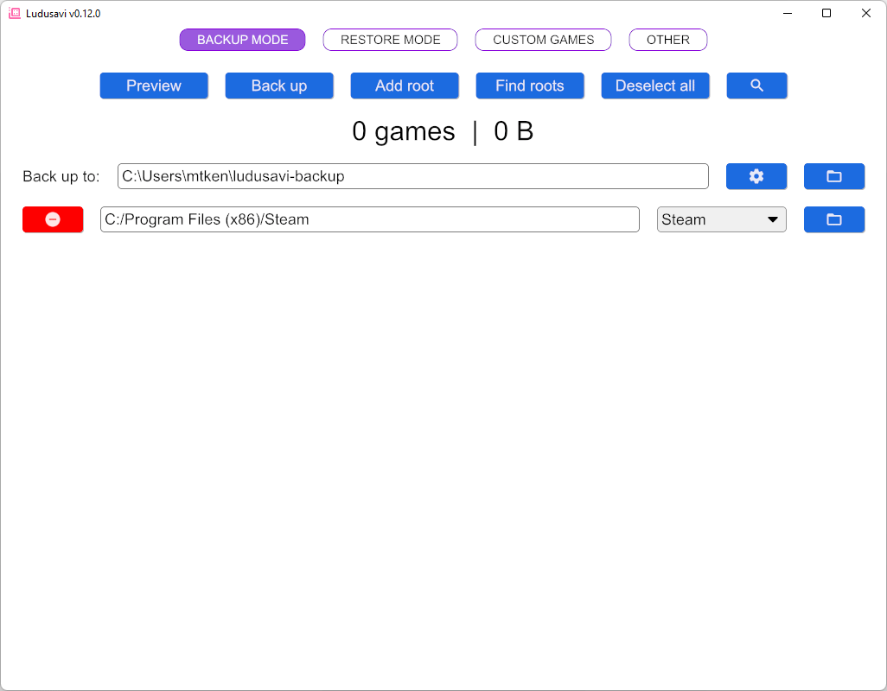

#  Ludusavi
Ludusavi is a tool for backing up your PC video game save data,
written in [Rust](https://www.rust-lang.org).
It is cross-platform and supports multiple game stores.

## Features
* Ability to back up data from more than 19,000 games plus your own custom entries.
* Backup and restore for Steam, GOG, Epic, Heroic, Lutris, and other game libraries.
* Both a graphical interface and command line interface for scripting.
  Tab completion is available for Bash, Fish, Zsh, PowerShell, and Elvish.
* Support for:
  * Saves that are stored as files and in the Windows registry.
  * Proton saves with Steam.
  * Steam screenshots.
* Available as a [Playnite](https://playnite.link) extension:
  https://github.com/mtkennerly/ludusavi-playnite
* Works on the Steam Deck.

This tool uses the [Ludusavi Manifest](https://github.com/mtkennerly/ludusavi-manifest)
for info on what to back up for each game.
The data is primarily sourced from [PCGamingWiki](https://www.pcgamingwiki.com/wiki/Home),
so please contribute any new or fixed data back to the wiki itself,
and your improvements will be incorporated into Ludusavi's data as well.

If you'd like to help translate Ludusavi into other languages,
[check out the Crowdin project](https://crowdin.com/project/ludusavi).

## Demo
<!-- These anchors are kept for compatibility with old section headers. -->

> 

## Installation
<!-- These anchors are kept for compatibility with old section headers. -->

Download the executable for Windows, Linux, or Mac from the
[releases page](https://github.com/mtkennerly/ludusavi/releases).
It's portable, so you can simply download it and put it anywhere on your system.

If you prefer, Ludusavi is also available via
[Winget, Scoop, Flatpak, and Cargo](docs/help/installation.md).

Note:

* Windows users may see a popup that says
  "Windows protected your PC",
  because Windows does not recognize the program's publisher.
  Click "more info" and then "run anyway" to start the program.
* Mac users may see a popup that says
  "Ludusavi can't be opened because it is from an unidentified developer".
  To allow Ludusavi to run, please refer to [this article](https://support.apple.com/en-us/102445),
  specifically the section on `If you want to open an app [...] from an unidentified developer`.

## Usage
<!-- These anchors are kept for compatibility with old section headers. -->

Detailed help documentation is available for several topics.

### General
* [Backup automation](/docs/help/backup-automation.md)
* [Backup exclusions](/docs/help/backup-exclusions.md)
* [Backup retention](/docs/help/backup-retention.md)
* [Backup validation](/docs/help/backup-validation.md)
* [Cloud backup](/docs/help/cloud-backup.md)
* [Custom games](/docs/help/custom-games.md)
* [Duplicates](/docs/help/duplicates.md)
* [Filter](/docs/help/filter.md)
* [Game launch wrapping](/docs/help/game-launch-wrapping.md)
* [Redirects](/docs/help/redirects.md)
* [Roots](/docs/help/roots.md)
* [Selective scanning](/docs/help/selective-scanning.md)
* [Transfer between operating systems](/docs/help/transfer-between-operating-systems.md)

### Interfaces
* [Application folder](/docs/help/application-folder.md)
* [Backup structure](/docs/help/backup-structure.md)
* [Command line](/docs/help/command-line.md)
* [Configuration file](/docs/help/configuration-file.md)
* [Environment variables](/docs/help/environment-variables.md)
* [Logging](/docs/help/logging.md)

### Other
* [Troubleshooting](/docs/help/troubleshooting.md)
* [What if my saves aren't found?](/docs/help/missing-saves.md)

## Community

The community has created some additional resources you may find useful.
Please note that this is not an exhaustive list
and that these projects are not officially affiliated with Ludusavi itself:

* Secondary manifests:
  * https://github.com/BloodShed-Oni/ludusavi-extra-manifests
  * https://github.com/hblamo/ludusavi-emudeck-manifest
  * https://github.com/hvmzx/ludusavi-manifests
    * This has an example of using a scheduled GitHub workflow
      to generate a manifest that adds more paths to the primary manifest's entries.
* Plugins for Decky Loader on Steam Deck:
  * https://github.com/GedasFX/decky-ludusavi
* Plugins for VS Code:
  * https://marketplace.visualstudio.com/items?itemName=claui.ludusavi
* Tools:
  * https://github.com/jose-l-martins/GSM-to-Ludusavi-converter

## Comparison with other tools
There are other excellent backup tools available, but not a singular
cross-platform and cross-store solution:

* [GameSave Manager](https://www.gamesave-manager.com) (as of v3.1.512.0):
  * Only supports Windows.
  * Much slower than Ludusavi. On the same hardware and with default settings,
    an initial scan of the whole system takes 2 minutes in GSM versus 10 seconds in Ludusavi.
    Performing a backup immediately after that scan takes 4 minutes 16 seconds in GSM versus 4.5 seconds in Ludusavi.
    In this test, GSM found 257 games with 2.84 GB, and Ludusavi found 297 games with 2.95 GiB.
  * Closed source, so the community cannot contribute improvements.
  * Interface can be slow or unresponsive.
    For example, when clicking "select all / de-select all", each checkbox has to individually toggle itself.
    With 257 games, this means you end up having to wait around 42 seconds.
  * Minimal command line interface.
  * Can create symlinks for games and game data.
    Ludusavi does not support this.
* [Game Backup Monitor](https://mikemaximus.github.io/gbm-web) (as of v1.2.2):
  * Does not support Mac.
  * Database only covers 577 games (as of 2022-11-16), although it can also import
    the Ludusavi manifest starting in 1.3.1.
  * No command line interface.
  * Can automatically back up saves for a game after you play it.
    Ludusavi can only do that in conjunction with a launcher like Playnite.
* [Gaming Backup Multitool for Linux](https://supremesonicbrazil.gitlab.io/gbml-web) (as of v1.4.0.0):
  * Only supports Linux and Steam.
  * Database is not actively updated. As of 2022-11-16, the last update was 2018-06-05.
  * No command line interface.

## Development
Please refer to [CONTRIBUTING.md](./CONTRIBUTING.md).
