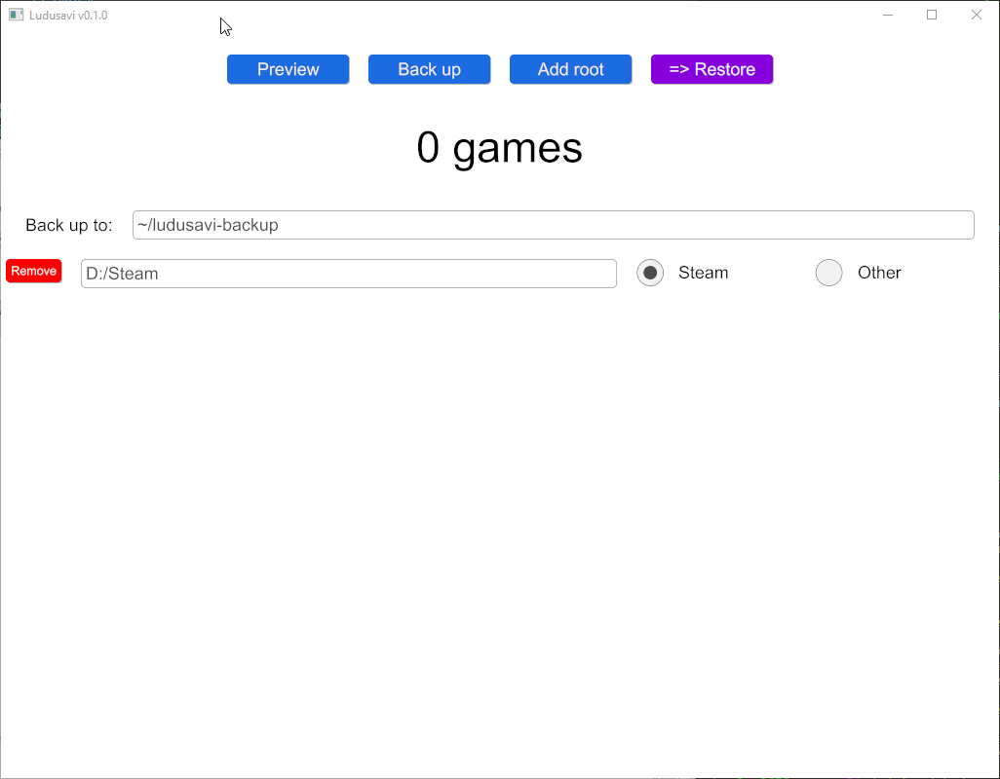

# Ludusavi

Ludusavi is a tool for backing up your PC video game save data, written in Rust.
It is cross-platform and supports multiple game stores.

This tool uses the [Ludusavi Manifest](https://github.com/mtkennerly/ludusavi-manifest)
for info on what to back up, and it will automatically download the latest version of
the primary manifest. To add or update game entries in the primary manifest, please refer
to that project. Data is ultimately sourced from [PCGamingWiki](https://www.pcgamingwiki.com/wiki/Home),
so you are encouraged to contribute any new or fixed data back to the wiki itself.

## Features
* Ability to back up data from more than 7,000 games.
* Backup and restore for Steam as well as other game libraries.
* Preview of the backup/restore before actually performing it.
* Support for saves that are stored as files and in the Windows registry.
* Support for Proton saves with Steam.
* Support for Steam screenshots.

> 

## Installation
Ludusavi is available for Windows, Linux, and Mac. However, your computer must
support one of these graphics systems: Vulkan, DirectX (11 or 12), or Metal.

* Download the executable for your operating system from the
  [releases page](https://github.com/mtkennerly/ludusavi/releases).
  It's portable, so you can simply download it and put it anywhere
  on your system.

  Alternatively, if you have Rust, you can run `cargo install ludusavi`
  to do the installation.
* If you are on Windows:
  * When you first run Ludusavi, you may see a popup that says
    "Windows protected your PC", because Windows does not recognize the program's
    publisher. Click "more info" and then "run anyway" to start the program.
  * If you see an error like "VCRUNTIME140_1.dll was not found", you will need
    to install or update the Microsoft Visual C++ Redistributable, which you can
    find [on this support page](https://support.microsoft.com/en-us/help/2977003).
    * For the 32-bit version of Ludusavi, you'll need the x86 redistributable.
    * For the 64-bit version of Ludusavi, you'll need the x64 redistributable.
* If you are on Mac:
  * When you first run Ludusavi, you may see a popup that says
    "Ludusavi can't be opened because it is from an unidentified developer".
    To allow Ludusavi to run, please refer to [this article](https://support.apple.com/en-us/HT202491),
    specifically the section on `How to open an app [...] from an unidentified developer`.

## Usage
### Backup mode
* This is the default mode when you open the program.
* You can press `preview` to see what the backup will include,
  without actually performing it.
* You can press `back up` to perform the backup for real.
  * If the target folder already exists, it will be deleted first,
    then recreated.
  * Within the target folder, for every game with data to back up,
    a subfolder will be created with the game's name encoded as base 64.
    For example, files for `Celeste` would go into a folder named `Q2VsZXN0ZQ==`.
  * Within each game's backup folder, any relevant files will be stored with
    their name as the base 64 encoding of the full path to the original file.
    For example, `D:/Steam/steamapps/common/Celeste/Saves/0.celeste` would be
    backed up as `RDovU3RlYW0vc3RlYW1hcHBzL2NvbW1vbi9DZWxlc3RlL1NhdmVzLzAuY2VsZXN0ZQ==`.
  * If the game has save data in the registry and you are using Windows, then
    the game's backup folder will also contain an `other/registry.yaml` file.
    If you are using Steam and Proton instead of Windows, then the Proton `*.reg`
    files will be backed up like other game files.
* Roots are folders that Ludusavi can check for additional game data. When you
  first run Ludusavi, it will try to find some common roots on your system, but
  you may end up without any configured. You can click `add root` to configure
  as many as you need, along with the root's type:
  * For a Steam root, this should be the folder containing the `steamapps` and
    `userdata` subdirectories. Here are some common/standard locations:
    * Windows: `C:/Program Files (x86)/Steam`
    * Linux: `~/.steam/steam`
  * For the "other" root type, it should be a folder whose direct children are
    individual games. For example, in the Epic Games store, this would be
    what you choose as the "install location" for your games (e.g., if you choose
    `D:/Epic` and it creates a subfolder for `D:/Epic/Celeste`, then the root
    would be `D:/Epic`).

### Restore mode
* Switch to restore mode by clicking the `=> restore` button.
* You can press `preview` to see what the restore will include,
  without actually performing it.
* You can press `restore` to perform the restore for real.
  * For all the files in the source directory, they will be decoded as base 64
    to get the target path and then copied to that location. Any necessary
    parent directories will be created as well before the copy, but if the
    directories already exist, their current files will be left alone (other
    than overwriting the ones that are being restored from the backup).

## Comparison with other tools
There are other excellent backup tools available, but not a singular
cross-platform and cross-store solution:

* [GameSave Manager](https://www.gamesave-manager.com):
  * Only supports Windows.
  * Closed source, so the community cannot contribute improvements.
  * Interface can be slow or unresponsive; e.g., when (de)selecting all checkboxes,
    it takes half a second per checkbox for them all to toggle.
* [Gaming Backup Multitool for Linux](https://supremesonicbrazil.gitlab.io/gbml-web)
  * Only supports Linux and Steam.
  * Database is not actively updated (as of 2020-06-20, the last update was 2018-06-05).

## Development
Please refer to [CONTRIBUTING.md](./CONTRIBUTING.md).
